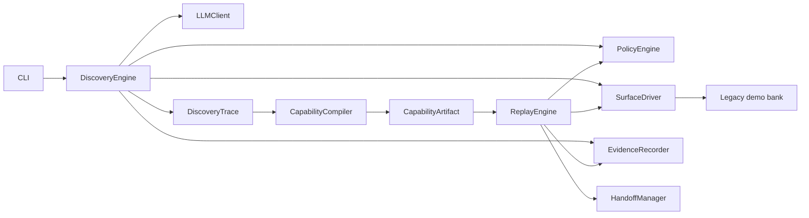

# Computer-Use Automation System

This repository is a thin, working vertical slice for turning a natural-language UI goal into a reviewable capability and replaying that capability deterministically. It targets a local synthetic legacy-banking site, uses an LLM only during discovery, compiles the resulting structured trace into a typed artifact, and then replays with no LLM import or call path.



Discovery is probabilistic and provider-backed; its actions are evidence, not the durable program. `CapabilityCompiler` is pure and converts only a successful, validated trace into an explicit draft artifact. Approval is a separate command. `ReplayEngine` consumes the approved artifact, typed inputs, one shared `Condition` model, and a `SurfaceDriver`; it cannot import discovery or an LLM adapter. The static boundary test and submission validator enforce that guarantee.

## Prerequisites and setup

Prerequisites are Python 3.11+, `uv`, and a Chromium-compatible host. A genuine discovery also needs one provider key. Do not use real financial data; every record in the demo is synthetic.

```bash
uv sync --all-extras
uv run playwright install chromium
cp .env.example .env
```

Put exactly one key in the untracked `.env`, or export it in the shell:

```bash
export ANTHROPIC_API_KEY='...'
# or
export OPENAI_API_KEY='...'
```

`.env.example` documents model, origin, evidence, runtime, and headless settings without containing a credential. `scripts/cu` is the repository-local CLI wrapper; it uses the project virtual environment and source tree consistently.

## One-command demo

With a provider key, this performs genuine discovery, deterministic compilation, explicit approval, a successful replay using a different input, a not-found replay, and the same-session handoff demonstration:

```bash
scripts/run_demo.sh
```

For development without a key, the following exercises the same live browser flow with a conspicuously labeled scripted decision client. It does **not** satisfy the genuine-discovery evidence requirement:

```bash
scripts/run_demo.sh --fixture
```

The app is health-checked rather than awaited with a fixed delay. The script refuses an occupied port, traps child-process cleanup, never prints keys, and exits nonzero if the genuine run lacks a key.

## Exact manual demo commands

Start the bank in terminal one:

```bash
scripts/cu demo-app
```

In terminal two, run the through-line:

```bash
scripts/cu discover \
  --goal-file artifacts/examples/lookup_goal.json \
  --input member_id=12345 \
  --output evidence/discovery \
  --headed

scripts/cu compile \
  --trace evidence/discovery/discovery-trace.json \
  --output artifacts/examples/lookup_member_balance.v1.json

scripts/cu approve \
  --artifact artifacts/examples/lookup_member_balance.v1.json \
  --approved-by local-demo-reviewer

scripts/cu replay \
  --artifact artifacts/examples/lookup_member_balance.v1.json \
  --input member_id=12345 \
  --evidence-dir evidence/replay-success \
  --headed

scripts/cu replay \
  --artifact artifacts/examples/lookup_member_balance.v1.json \
  --input member_id=99999 \
  --evidence-dir evidence/replay-not-found \
  --headed

scripts/cu handoff-demo \
  --artifact artifacts/examples/open_sub_account.v1.json \
  --evidence-dir evidence/handoff \
  --headed
```

Expected terminal classifications are `success` with balance `1234.56`, `business_outcome` with `member_not_found`, and an escalation before the irreversible sub-account commit. During headed handoff, the human clicks **Commit sub-account** in the already-open browser and returns to the terminal; automation then re-observes and validates the same session before regaining ownership. `--automated-fixture-human --headless` exists only for deterministic testing.

All operations are discoverable through `scripts/cu --help`. Hard failures and configuration errors return nonzero. Business outcomes are valid terminal results and return zero.

## Artifacts and evidence

- `artifacts/examples/lookup_member_balance.v1.json`: compiler-produced, parameterized, approved lookup capability.
- `artifacts/examples/open_sub_account.v1.json`: explicit risky-flow example used for handoff.
- `artifacts/schemas/`: generated JSON schemas for the public Pydantic contracts.
- `evidence/discovery/`: reserved exclusively for genuine OpenAI or Anthropic discovery evidence.
- `evidence/fixture-discovery/`: clearly labeled scripted discovery, never submission evidence.
- `evidence/replay-success/`: typed decimal success plus JSONL events and screenshots.
- `evidence/replay-not-found/`: known business outcome evidence.
- `evidence/replay-retry/`: first-load checkpoint failure followed by one bounded retry.
- `evidence/replay-permission-denied/`: structured hard failure with expected, redacted observed state, and screenshot reference.
- `evidence/handoff/`: intervention record, ownership transitions, paused/resumed screenshots, and same-session validation.

Evidence is redacted before persistence. Invocation values and URL member segments are masked; credentials, headers, cookies, browser storage state, and profiles are never written. Screenshots are bounded to the synthetic local application.

## Tests and quality gates

```bash
uv run ruff format --check .
uv run ruff check .
uv run mypy src/computer_use
uv run pytest
scripts/verify_submission.sh
```

The strict verifier also regenerates schemas, validates example artifacts, checks the replay import boundary, scans for credentials and persisted raw member IDs, and validates evidence completeness. The latest full run passes 41 tests and reports 72% branch-aware package coverage; the load-bearing domain, compiler, replay, policy, evidence, resolver, and browser-driver modules are covered directly. Without a provider key and genuine discovery evidence, its final evidence check intentionally fails. To audit every locally controllable gate while that external prerequisite is unavailable:

```bash
ALLOW_MISSING_PROVIDER_EVIDENCE=1 scripts/verify_submission.sh
```

That override prints the external blocker; it does not relabel scripted evidence as genuine.

## Failure behavior and safety

Semantic resolution tries accessible role/name, then text, then label, and only an explicit structural fallback. Zero matches raise `TARGET_NOT_FOUND`; multiple matches raise `TARGET_AMBIGUOUS`. Checkpoints, waits, business outcomes, and final success share `Condition`. Known business outcomes are checked before hard-failure classification. Transient failures retry only for the artifact's allowlisted error codes and attempt count.

One `PolicyEngine` gates discovery and replay actions. It enforces origin/route/action allowlists, approval state, run limits, control ownership, and risk transitions. Irreversible actions release automation ownership and produce an intervention record. Automation cannot act while the human owns the session.

## Known limitations

The implemented surface is web-only and local. The operator UI is deliberately minimal. Remote co-browsing, production authentication, browser streaming, desktop/coordinate drivers, and multi-tenant storage are design seams rather than implemented features. Discovery depends on the provider's current model availability and remains probabilistic; production execution does not. A genuine discovery evidence bundle cannot be created without a user-supplied provider credential, and the repository never fabricates one.

## Repository tour

- `src/computer_use/domain`: strict contracts and four terminal replay statuses.
- `src/computer_use/discovery`: constrained observe-decide-act loop and provider adapters.
- `src/computer_use/compiler`: deterministic trace-to-artifact transformation.
- `src/computer_use/replay`: deterministic engine and condition evaluation.
- `src/computer_use/surfaces`: async protocol, strict resolver, and Playwright implementation.
- `src/computer_use/safety`, `handoff`, `observability`: shared guardrails, ownership, redacted evidence.
- `demo_app`: FastAPI/Jinja synthetic legacy portal with deterministic failure fixtures.
- `tests`: contract, compiler, policy, discovery, demo HTTP, and real-browser integration tests.
- `scripts`: local CLI, full demo, secret scan, and submission verification.
